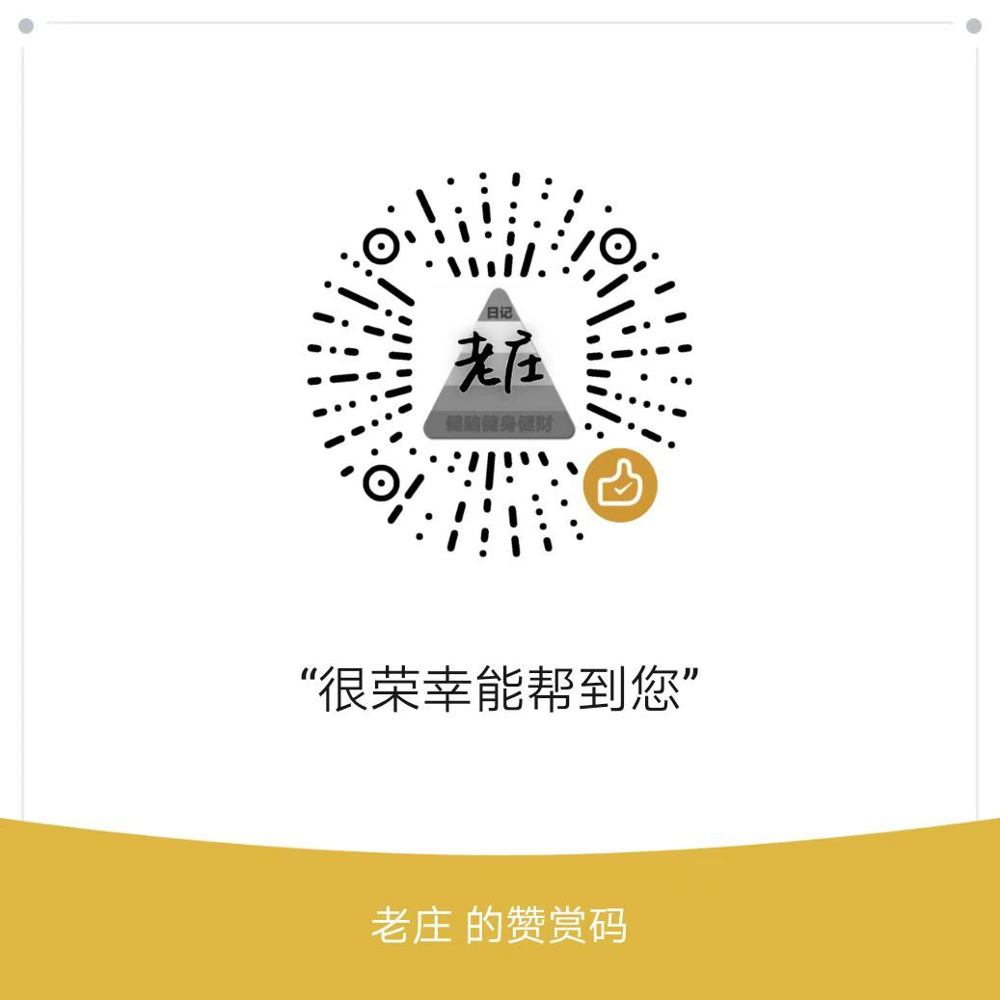

# 第一次租房想不被坑的预防针

### 第一次租房想不被坑的预防

\--

租房，应该是很多大学生真正意义上的社会第一课，这个过程会打破很多对人性美好的期待。

没有期待，就不会被伤害。这话要等被社会教育几年才懂。

租房不想被坑，最重要的第一点，就是改掉一个心态，贪便宜的心态。

你想贪便宜，遇到的一定是骗局，看上去占到了便宜，一定会在其他地方把占到的便宜加倍还回去。

什么叫贪便宜？

在一片月租3000的房源里，你觉得那个月租2000的就是老天爷赏赐给你的，是你运气好捡到了漏，占到了便宜。

放心，你觉得自己赚到了便宜，对方是傻子，后面一定有坑等着你，来证明你是傻子，没有例外。

怎么真正便宜买到好货？

掏钱掏感情买别人的专业，掏时间补全自己的认知和经验。

要么，你有当地认识的朋友、亲人、中介，请他帮你选一套合适的房子。

要么，你脸皮厚、意见足，自己花一两周时间查攻略、跑上几十套房，选一套相对适合自己的。

少走弯路，就是最大的便宜。

不存在分币不花净省一千块这种不劳而获的好事。

牢记，租房有个不可能三角，绝不存在一套便宜、舒适、离公司近的天选之房就在那等着你去租。

绝不存在！舒适，离公司近，就得贵，离公司近，便宜，就大概率不舒适。

世界一切关系都讲究个交换，你想得到什么，一定要付出什么才行。

不劳而获这种想法，平常调侃下没问题，千万别当成自己的信念。

\--

我知道很多人习惯了谈感受，谈实惠，谈性价比，我刚开始的时候也有这种心态。

但是，你终会回归事实，抛开感受，看事实，看市场，看供需，看利益。

放下幻想，关注事实。

谁不想占点便宜省点钱呢？

但是你就是要反过来，当大多数人想占便宜的时候，一定会有人利用大多数人这个需求去骗人，你放弃占便宜的想法，才能最有效率租到预期内的房子。

认清事实，才能和事实相处。

\--

怎么提高租房效率？

找熟人，自己查，找中介，找网友。

信任程度逐级递减，被欺骗程度逐级递增。

信任是怎么回事？就是你愿意承受一定的背叛成本。

熟人不会在这种小事上坑自己，自己去查资料要看辨别能力，中介和网友是陌生人，背叛成本低，有可能捞一波就跑路。

我愿意相信人性很美好，善良的人更多，但是我也更知道，涉及到利益的时候，人性里的恶很容易被激发出来。

人性皆善的理想，自己谈可以，别逼着别人和你一样有理想，先看好利益这条底线。

很多事情想不明白的时候，从利益角度思考，就会很清晰。

怎么看利益？

就是站在对方角度思考问题，他能在这次交易中得到什么。

他能给我提供我需要的房源，我给他提供的是什么，钱？名声？满足感？

千万不要觉得一个比你社会阅历多的人会是个傻子，可能图你钱图你颜图你傻白甜。

从这个角度思考，很多网友需要的无中介费这点，房东直租是可能的，找合租是可能的，转租让人来接盘是可能的，因为他们能在上面赚到钱或者省下钱。

一个中介说自己不收中介费，那就不可能，上班不为赚钱，乐山大佛都得给他让位子。

怎么判定中介和网友值不值得信任？

要看，假设他把你拉黑了，你有没有办法维权，有没有让他因为背叛付出更重的损失。

比如，他是品牌旗下中介，有实名有编号，他坑你，你反过来去投诉，去曝光，去平台旗下指名道姓说他做的错事，他就可能丢工作，这损失比坑你一单要要大，可信度就会高一些。

比如，他是小红书、咸鱼、豆瓣，微博加你的，你不知道他的公司和他的实名，就知道个昵称和他发的帖子，真实性无法判断，他拉黑你，你基本找不到他，可信度就比较低。

\--

整个租房过程以及后续居住过程，安全一定是第一位的。

人身安全，信息安全，资产安全。

人身安全，能选电梯房，不选楼梯房，能选整租，不选合租，能和同性合租，不和异性、情侣合租。只有你一个人能保证自己的安全，有他人存在，就有风险存在。

信息安全，和中介、房东交流沟通过程，不要相信任何口头承诺，该录音录音，聊天记录保存好，要求和细则一定要白纸黑字落在合同上，确保对方违约的时候，你能有依据维权。

资产安全，没签合同之前，不因任何理由交钱，定金这东西不管用的，只约束租客不约束中介，别人愿意全款就把你顶了。签完合同，一手交钱，一手拿钥匙，按合同办事。

\--

暂时想到这些想不被坑需要预防的地方，如果你有其他心得可以评论区留言。

全流程租房手册可以去网站zufangshouce.com或lzrj.fun/zufang查看。

后面会在网站补一些租房之后家电维护，家居常识之类的知识，那些东西对我来说是常识，对你来说可能就是要走很多弯路才能意识到的东西，这篇帖子反馈多的话，会加快这个进度。

\-

如果你有其他租房心得或疑惑，或者认为此攻略有需要修改的地方，可以去微信公众号老庄日记后台留言具体内容，帮助使这个租房手册更加完善。

\--

如果你从事房产租赁相关工作，是一个讲诚信的人。可以在公众号6月7日文章评论区留言【地区】【业务范围】【联系方式】等信息，我会统一整理到租房手册中方便需要租房的人沟通。

\--

此攻略以对租房完全没了解的小白视角来写的全流程，可能啰嗦，之前做功课感觉熟悉的地方可以跳过。

租房，网上一般分两大类，一种是，学校当地工作，周围相对比较熟悉，随时可以过去看房。一种是，去外地工作，看房不方便。

我是社恐，更倾向于不怎么和人打交道的方式，事前准备充分，大多数问题都在线上沟通完成，线下就是看房、签合同、拿钥匙。

你需要租房，这里就假设你已经定下了工作地点，要在围绕这个工作地点一定范围内租到房子。

一定要记得，不能贪心，离得近、便宜、舒适，是不可能三角，不可能同时满足，优先考虑最重要的两点。

需求越少，越容易找到合适的。

同时不要被骗，交钱只发生在签合同之后，之前任何收费理由，都不要给他交钱，定金只是约束你的，对中介没有约束，别人来租你看好的房子，照样能租走。

**一手交钱，一手拿钥匙，这才是正常流程。**

好多攻略说预算不要超过工资三分之一，这个因人而异，如果你对职场预期很好，觉得自己工资会涨很快，或者有发展副业的想法，那就尽量多花钱选离公司近同期时间短的，把省出来的时间用在提升自己上面，以后可以赚到远超在房租上省出来的钱。

你觉得钱更有价值，那就拿时间换钱。你觉得时间更有价值，那就拿钱换时间。

自己想得通就好。

### 一，线上定位置和价格

①打开贝壳/链家app，进入租房页面。

（其他租房软件也有相似功能，但是假房源比较多，很难准确预估平均价格。）

你会看到，房子分三类，整租，合租，公寓。

{

整租就是，你自己租一套房子，一室，两室，三室，都是你自己住，别人进不来。

合租就是，你和别人一起租一套房子，别人住一间，你住另一间，走一个大门，可能还要共用一个厕所。

一般整租和合租分类下都是居民楼，一层1-6户，民水民电，租一季度还是租一年，中介费都是月租的一定比例，比如，石家庄是70%，这个费用可以直接线上咨询中介，适合长租。

公寓分类下，包含整租和合租类型，和居民楼的区别是，多数公寓类似酒店一层多户，商水商电，日常费用比较高，中介费用改为服务费，按月交，适合短租。

}

②然后点开地图找房。建议手机旁边放纸和笔，方便记录对比。

租房、消费都不要靠感觉，要相信数据和逻辑，整理数据，做好分类对比，预算不足，一定会做很多取舍，选条件范围内愿意接受的。

③在地图找房这个页面的上面一排，根据自己的预算和其他需求，选择筛选条件，一般是筛选【预算】和【整租/合租】这两项，房源太多的话，再加选其他选项。

{

从舒适度来说，小区整租>公寓整租>合租，从长租价格来说，公寓整租>小区整租>合租。

选自己认为最重要的，喜欢社交，就去合租，去公寓，喜欢独处，就去整租，去找小区。

}

④找到你要工作的地点，然后围绕这个点，上下左右都翻一翻，把符合筛选条件、自己看着实拍还不错的【小区名字】【通勤时间】【房租】【家具】以及【厨房】【宽带】【电梯】这些自己更关注的东西都记在纸上。

{

这里要注意高层低层，来区分老小区和新小区，以石家庄为例，一般6层以下就是老小区，没有电梯，同样户型相对新小区比较便宜，但是家具、电器老旧，供暖和空调不太给力，室内看上去没那么干净明亮。

还要在地图上看一下，小区一圈如果有能同时通过四辆车的公路，说明平常车会很多，大概率会受到噪音影响。

\-

如果公司附近有地铁站，距离选择范围可以广一些，按通勤时间算，从出门到公司，一线城市通勤时间最好控制在1小时以内，二线城市控制在30分钟以内，时间太长会丧失斗志，公交/地铁学习就是个伪命题，通勤时间又挤又吵，学不下去的。

你溜达10分钟去上班和1小时倒换几趟车去上班，工作心情和效率完全不一样。

通勤时间可以可以换算成钱+未来3年的回报率。比如月薪9000，965，平均一小时值50R。

为了省钱租得远，这一小时用在通勤上，会消磨心气，会降低工作产出，浪费的是50R+工作潜力+后续恢复这段时间消耗精力的时间。

省出来用在自我提升上，三年后可能发展出副业，也可能工资翻倍，无论如何，你都会变得更值钱。

如果省出来时间只是为了多刷会抖音，那还是租得远远的，做个没有感情的螺丝钉、工作机器，做好35岁再毕业一次的准备。

如果你不改大学时的志向，预期5年内能年薪百万，就更该多节省宝贵时间，花钱买时间。

对未来个人发展的期许比较高，预算有限，通过降低居住质量来减少通勤时间，节省出更多时间来提升自己，是一笔稳赚不赔的买卖。

其他选择也可以这样计算，本质上是把生活品质折合租金成本，觉得划算就去改预算。

}

看上几十套房，你基本就对工作地周边的租住环境和价格有一个基础的了解了，接下来就是联系中介或者房东，确定租房。

{

其中需要注意的是串串房，也就是新装修3个月以内，家具的味道还没散去，有甲醛，会对身体造成不好影响。

看到全新家具，但是价格在同小区老旧家具平均水平，就可能有坑。一般新装修的房子，尤其是房东按自住标准装修的房子，租金会在同户型里偏高一些。

甲醛报告这东西也是不可信的，雇主是房东，很多公司会满足雇主要求，私自改数据。

进屋子闻着有味道，就赶紧撤，相信直觉，别信报告和房东说辞。

另外法律上支持甲醛房维权，租后检测发现甲醛超标，可以无责退房。

}

### 二，找中介，找房东

在谁那租房，分四种，平台中介、小公司中介、临期转租/房东直租、二房东转租。

以下是按省事程度从高到低排序，同样，也是花钱费用从高到低，想提高效率就多花钱，想省钱就多看多跑多对比。

不存在钱少事少这个选项。牢记在老庄日记公众号写的不被坑那些内容，千万不要贪心。

①平台中介

贝壳/链接的房源，你直接线上和中介聊就行，租金、位置、水电、看房时间这些你关系的问题，他们都会如实回复。

贵，但是他们能对真房源打包票，你线上看到的图片和VR，线下去看房就是那套，所见即所得。

还有几个比较大的平台中介，中介费相对较低，比如石家庄有几个收50%中介费的大平台，他会用假房源骗你加上微信，然后给你推荐其他房子，这种被骗的感觉很恶心。

假房源就是那种你一眼看过去价格低、离公司近、家具干净，简直梦中情房，这种实际不存在的房子，就是拿来骗你的，让你加微信交流，加过去就告诉你房子刚租出去，看看别的。

还记得公众号告诉你不要贪心的不可能三角吗？不贪心就不会被骗。

②小公司中介

这种中介公司一般就在小区楼下，中介相对贝壳便宜一些，好多也接入了贝壳的系统，而且相连的几个公司还有可能会共享房源，你去A公司和B公司看到的房子可能是一样的。

很多小公司就靠附近三四个小区过日子，会有一些独家房源，网上看不到，可以线下去和中介说自己就要附近几个小区的房子，让中介带你去看。

至于哪家有好房源，哪家是坑货，你得按照你之前记录下来的小区一个个去跑、一个个去问。

圈好小区和范围，找几家中介门店，勇敢的走进去，你会发现只要你不付款，你就是上帝。

\-

另一种就是一些创业公司在做的租房app、小程序，相对比较真诚，但是知名度不高，寻找难度大，北京上海深圳就有很多这样的小团队在做，可以去微信搜索框搜一下所在城市的租房小程序和公众号。

③临期转租、房东直租

1\)临期转租，一般是上个租客按照合同，还有3个月以上到期，但是马上就要离开这里，剩下的租金按合同也不给退，所以希望找个人来替他承担一部分租金，碰到合适的你就能捡个漏。

2\)房东直租，一般是房东对房客要求比较高，希望能自己谈，且不想让中介赚差价。

这两种房源，就不要指望能在租房app上找到了，租房app已经被中介包围，没得指望。

得去豆瓣、抖音、小红书、闲鱼、微博、QQ群这些自媒体平台上找，社交账号的动态比较难作伪，可以多翻翻，直接搜纸上写的那些“意向小区+租房/转租/直租”，搜不到，再尝试把搜索范围扩大到区、市。整体上来说，找到合适房子的难度比较高。

现在很多引流的中介会伪装成临期转租、房东直租，然后拿一些不存在的梦中情房来忽悠你加他微信，辨别难度很高，但是那种点进主页全是房子的，一定是引流的中介。

{

微博/小红书：直接搜索“某地+租房”或者“某地+转租”，按实时或者超话可搜出很多信息。优点是个人转租与平台等很容易分辨，而且可以直接与发布人取得联系。

豆瓣租房：有两种进入方式，豆瓣网页或者APP进入小组，搜“城市名+租房”，租房交易活跃的地区还可以搜“区域名+租房”，比如杭州滨江直接搜“滨江搜房”就会出来很多相关小组。

不幸的是，豆瓣小组已经被中介、平台长期占领，套路是会在标题中加上“房东直租”引诱你。

建议小组内直接搜索“转租”，得到真实房源的几率大些，但要注意搞清楚转租的具体情况。

微信群：群建立的目的各不相同，有的是为了推广自己的租房小程序/APP，有的纯粹是群主个人兴趣建立，有的是本地“包租婆（房东）”建立用来利人利己，群里的房子质量往往较高，难点在于入群方式。可以从豆瓣租房小组、微博寻找，一般会有二维码或者群主微信号。

这些平台本身几乎对房源**没有任何监管**，中介们早已轻松占据了这块平台，无论真假都可以随意发布租房信息。在**安全性方面也缺乏足够的保障**。**只通过自媒体平台，很难完整判断一个房子的信息**，都需要添加微信，进行进一步的详细沟通。

由于筛选功能的缺失，以及信息的杂乱，**在自媒体平台联系到一套房子花费的时间远大于其他租房平台**。如果不是时间特别充裕，且不怕麻烦。并不是非常推荐这些平台。

\-

**非中介房主一般包含以下几个特征**：

1. 个人主页发布的房源信息通常只有1-2个
2. 房子图片较为“真实”（没有广角、没有打光、没有美颜，一看就是随手拍的）
3. 联系方式通常只留了电话和微信，并且私信聊天不会强烈要你加微信
4. 回复速度比较慢。

}

另一种方法，就是去你写下来的那些小区，挨个跑，和保安、保洁、物业、门口晒太阳的叔叔阿姨多聊聊，问问小区内有没有要租的房子，让他帮忙去小区群里再问问。

有麻将馆的地区会更好，里面的叔叔阿姨，有钱有闲还有房，勇敢往里闯就是了。

别白问，带包烟、带瓶水递过去，让别人觉得没白帮你，如果以后住进来，也算是有个熟人。

**如果已经办理入职，**可以从同事那里了解到一些租房的信息，同事们租房一般都提前考虑好了上面的几个关注点，在同事所在的小区自己去找房源也能节约不少时间。

④二房东转租

二房东，算是中介的另一种形式，可能是个人独立干中介，也可能是一套房子里其他房间往外转租，就是指的这个房子不是他的，也是他去租的别人的房子然后转租给你，都是不太合规的形式，而且随时有跑路风险，结合之前公众号写的背叛成本的计算，找二房东很不划算。

但是因为利润比较高，钱都能装进自己腰包，所以会比房东、正式中介的动力强一些。

我个人是不建议找二房东，后续遇到问题，解决起来比较困难。

有找二房东的功夫，找找真实的临期转租租客和房东，和小区叔叔阿姨聊聊天，更有效。

### 三，看房源，签合同

前面一套流程下来，应该至少能够筛选出2-5套意向房子，也见过了照片，该聊的东西都聊过了，知道屋里有什么没什么，接下来就可以和对方预约一个看房时间。

租房一定要线下去考察，设施、卫生、环境、交通只有去看了才能感受到好不好。

看房，网上会告诉你不要选临街的，太吵，要选向阳的，早上晚上都去一次别碰上太吵的上下楼邻居。

但这个东西，防不胜防，可能今天安静，明天就震楼，向阳都想要，加钱就好办。

关注点越少，预期越低，越容易找到好房子。外部环境、人的因素，你控制不了，干脆不想。

多关注日常要用到的硬件设施，离公司的距离近不近、有没有共享单车停车点、公交方不方便、洗衣机好不好用、晾衣服方不方便，冰箱空调能不能用，这些切实对个人有影响的因素。

提灯定损这种幺蛾子是极小概率事件，没必要去死抠细节，哪里蹭点皮拍照留个证据，哪里太旧了可能会坏。

约见房东，看人品，素质，主要试探长租问题，有没有卖房打算，有没有子女快毕业了需要房子，都要问问，然后问问维护问题，谈不拢可以说自己补钱房东换，反正回头都留给房东。

边卖边租的删除，子女有打算的删除，房东脾气暴躁的、语气带对抗的、蛮横的删除，长租是长期合作，人和人观念冲突太大随时会有问题。

家具家电能正常使用，房东不留备用钥匙私自上门，水电气沟通好价格和缴费方式，按合同办事，就算是好房东。

功课提前做好，尽量不要面对面一个劲挑房子的问题，这就像指着爹妈说孩子傻，硬生生把房东推向你对立面，不划算。

价格

一般是押一付三，交一个月押金，每三个月交一次房租。

想要便宜点，可以问半年一付、一年一付能不能抹个零，给个优惠。

**应届生和房东直租，也可以和房东商量先押一付一，发工资了再押一付三。**

**水电费、燃气费**

水电费燃气费是阶梯计价。一般情况下，**第一阶梯内都是够用的**。以石家庄为例，峰电0.55元/度，谷电0.3元/度，水费2.83/立方米，燃气费3.15/立方米。超过这个价格的要么是商水商电，要么就是乱收费。

**物业管理费**

管理费包括安保、楼道的清洁、电梯的维护等公共区域设施的管理，收费跨度从几十到几百不等。越高档的住宅区，收费越高，反之较低（**回迁房没有物业费**）。

**网费**

**整租可以自己拉条网线，打当地客服电话办宽带就可以。**合租一般情况不允许私拉网线，需要交网费，有一些房子会把网费一起算在物业费里。

**租房的中介费**

如果你是委托中介找房的，需支付一定的中介费，多数平台是**租客独自承担**，但也存在全部有房东或者共同承担的情况，租房的时候需要先了解清楚。

如果是正规中介公司，涉及到钱和责任归属的东西，都会在合同上明确标明，所以一定要逐字阅读合同。

上面家具坏了谁修，水电物业费谁交，房东不想租了怎么给房客赔钱，房客不想租了怎么给房东赔钱，有无卫生费、物业费、维修费、停车费、充电费、包裹暂存费都有具体说明，如果不认可的话，要和对方商量着修改。

尤其是合租，每个月价格该怎样算，写在合同上。和室友一定要说清生活规则，比如几点后发出噪音、卫生如何分配等。

签合同前记得确认对方的身份（身份证、房屋产权证等），再把合同从头到尾仔仔细细看一遍，以防被坑

所有添加家具、改善环境之类的承诺都要在搬进来前落实好，否则就要写进合同里

转账付款的时候，需要进行备注（三个月房租6000元+押金2000元），备注需要详细。最好能在微信聊天里面也发一下，方便后续留作证据。

\-

谨慎再谨慎，长租不是短租，任何一点不对，拔腿就走，不要相信任何人对你说的紧张、速度，比如中介说这房子昨天就3批人来看了，房东只有今天有空，先交定金，先签字不然就没了。

只要有人抢，你就立刻让，会耍花样的人，都是风险，没有任何租房是等上3天就不行的，如果有，身处热门资源也是风险。

### 四、搬家和室内整理

关于搬家和时间考虑，搬家尽量找搬家公司，别和十年二十年前，找什么亲戚朋友帮忙啥的，毫无意义，专业的搬家公司，只要你把细软电脑这些收拾一下，其他的都让搬家公司动手，几个小时能把房子彻底清空。

找附近的搬家公司或者货拉拉、滴滴搬家等之类的平台，他们有面包车和小货车，根据你的需求来选择合适的车型。

大件邮寄：如果你需要寄送大件包裹，德邦或者顺丰大件用的比较多，或者去小红书查攻略，看最近什么平台快递更划算。

贵重物品随身携带: 重要的证件、贵重物品等，最好随身携带，避免丢失。

在入住前，记得给房间各个角落都拍个照，尤其是墙面、地板、家具等容易出现问题的地方，留个证据，避免以后产生纠纷，方便以后退租时说清楚。

退房也好续约也罢都尽量提前告知，退房之前做好卫生，以免影响评估，产生额外费用。

\-

住进去以后，不要心里有胆战心惊的感觉，当前租房风险有且仅有一个月押金，这是对房客极大的利好。

撬锁(忘带钥匙)/装拆柜子/打隔断/封拆阳台/泡水(忘关水)/挖槽铺网线/贴墙打钉钻孔/养宠物……这些事理论上都不建议做，做了就要承担押金损失，但是没必要心惊胆战，最大损失就是一个月押金，如果因为大手大脚已经超了，那该咋样咋样也不要睡不着觉，住不下去就扔了押金换一套。

当前中国租房市场，不主观故意涉刑就可以。

第一次租房不要兴奋到买一大堆租房好物，一是不一定用得上，二是占地方，也尽量不要各种爆改（微调微改经过房东同意就可以），除非能确定租期很长，不然就是浪费钱

**住在哪里，都要保护好自己、保护好自己、保护好自己，该怂就怂，能屈能伸。**

如果此攻略帮助你租到了合适的房子，可以微信扫码赞赏1元，提醒我抓紧完善其他租房后续的相关知识。

### 公租房/租房补贴

待整理，可去老庄日记微信公众号催稿或提供信息

### 附录：部分中介联系方式

### 附录：租房常用词汇

①整租：把一整套房子都租下。

②合租：出现主卧、次卧的房源一般是合租，与陌生人合租最好核实清楚对方身份，互留联系方式。

③正规单间：指非隔断的房间，一般为合租。如果是独立一居室，一般称为“正规一居”或“独立一居”。

④大开间：客厅卧室一体的一居室户型，即一间“大房+卫生间+厨房”，可能还有阳台。

⑤押N付N：付房租和押金的方式。一般是“押一付三”，即交1个月房租作为押金，每3个月交1次房租。

⑥南北通透：最好的房屋朝向，南北都有窗户，通风好采光好；朝东的房屋，早上被太阳直射下午光线暗；朝北的房屋采光较差，冬天比较冷；朝西的房屋，夏天会很晒。

**⑦水电**：水电分为两种，商用水电和民用水电。商用水电的费用比民用水电的费用高，公寓采用的是商用水电，住宅采用的是民用水电。

**⑧长租、短租：**长租：一年以上的合同租期，短租：一年以下的合同租期

**⑨免租期**：出租方给承租方免除房租的期限，这段时间房东不收取房租，但是需要承担相应的物业费。

### 待更新……
