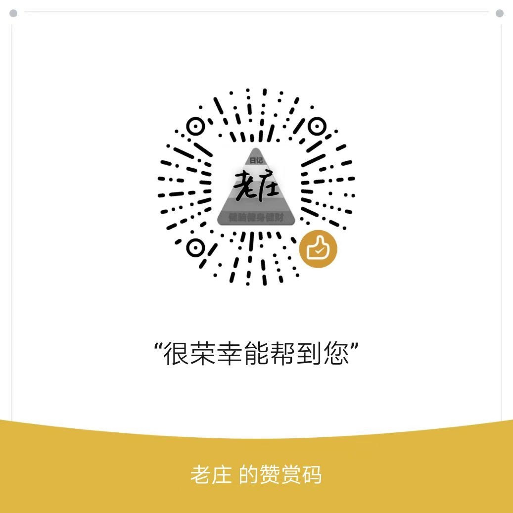

# 四、搬家和室内整理

### 四、搬家和室内整理

关于搬家和时间考虑，搬家尽量找搬家公司，别和十年二十年前，找什么亲戚朋友帮忙啥的，毫无意义，专业的搬家公司，只要你把细软电脑这些收拾一下，其他的都让搬家公司动手，几个小时能把房子彻底清空。

找附近的搬家公司或者货拉拉、滴滴搬家等之类的平台，他们有面包车和小货车，根据你的需求来选择合适的车型。

大件邮寄：如果你需要寄送大件包裹，德邦或者顺丰大件用的比较多，或者去小红书查攻略，看最近什么平台快递更划算。

贵重物品随身携带: 重要的证件、贵重物品等，最好随身携带，避免丢失。

在入住前，记得给房间各个角落都拍个照，尤其是墙面、地板、家具等容易出现问题的地方，留个证据，避免以后产生纠纷，方便以后退租时说清楚。

退房也好续约也罢都尽量提前告知，退房之前做好卫生，以免影响评估，产生额外费用。

\-

住进去以后，不要心里有胆战心惊的感觉，当前租房风险有且仅有一个月押金，这是对房客极大的利好。

撬锁(忘带钥匙)/装拆柜子/打隔断/封拆阳台/泡水(忘关水)/挖槽铺网线/贴墙打钉钻孔/养宠物……这些事理论上都不建议做，做了就要承担押金损失，但是没必要心惊胆战，最大损失就是一个月押金，如果因为大手大脚已经超了，那该咋样咋样也不要睡不着觉，住不下去就扔了押金换一套。

当前中国租房市场，不主观故意涉刑就可以。

第一次租房不要兴奋到买一大堆租房好物，一是不一定用得上，二是占地方，也尽量不要各种爆改（微调微改经过房东同意就可以），除非能确定租期很长，不然就是浪费钱

**住在哪里，都要保护好自己、保护好自己、保护好自己，该怂就怂，能屈能伸。**

**-**

如果此攻略帮助你租到了合适的房子，可以微信扫码赞赏1元，提醒我抓紧完善其他租房后续的相关知识。

